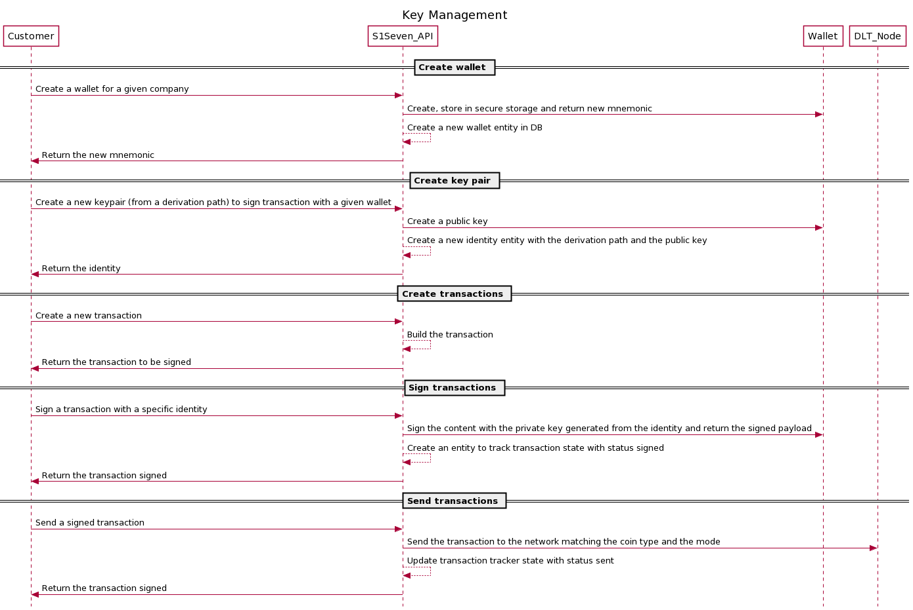

# API flows

[[toc]]

The following description details how S1Seven can notarize companies material certificates.

## Key management flow

<p align="left">
  
</p>

### Create a wallet

A wallet allows a company to generate key pairs to sign document and transactions for supported blockchains, it is composed by a mnemonic phrase that is the root of all key pairs.

To create a new wallet you can call the [create wallet] endpoint. You should set :

- the `company` HTTP header with the company's Id you previously created.
- the `mode` HTTP query with the context you work in

The options in body content is optional.

```sh
curl --request POST \
  --url https://<km-service>/wallets?mode=test \
  --header 'content-type: application/json' \
  --header 'company: <company-id>' \
  --header 'authorization: Bearer <jwt>' \
  --data '{
    "name": "wallet label",
    "options": {
      "language": "english"
    }
  }'
```

::: danger
The `mnemonic` that will be returned should be stored with extra care, as it will be displayed only once and it allows to recreate key pairs used to sign transactions that can be sent directly to the blockhain node.
:::

### Create a first identity

The identities contains metadata that allows our service to create keypairs without exposing or storing their private parts. Each identity gives the path to one specific keypair that you will use in a later step to notarize certificates.
The logic is based on the key derivation as described in the [BIP32](https://github.com/bitcoin/bips/blob/master/bip-0032.mediawiki) and the key space organization as described in [BIP44](https://github.com/bitcoin/bips/blob/master/bip-0044.mediawiki).

To create an identity, use the [create identity] endpoint. You should set several parameters:

- the `company` HTTP header with the company's Id you previously created
- the `mode` HTTP query with the context you work in
- the `wallet` HTTP body property with the wallet's Id you previously created
- the `coinType` HTTP body property, should only be set to 822, it will scope and create keypairs working on BigChainDB.
- the `account` HTTP body property, constitutes the first derivation level for the key pair creation, it can be mapped to a given department in a company for example.
- the `index` will be automatically incremented on the service side, it constitutes the second derivation level for the key pair creation, it allows to create key pairs for single usage and increase discretion of the transactions.

```json
{
  "coinType": 822,
  "account": 0,
  "wallet": "walletId"
}
```

```sh
curl --request POST \
  --url https://<km-service>/identities?mode=test \
  --header 'content-type: application/json' \
  --header 'company: <company-id>' \
  --header 'authorization: Bearer <jwt>' \
  --data '{
    "coinType": 822,
    "account": 0,
    "wallet": "walletId"
  }'
```

### Build a transaction

TODO

### Sign a transaction

TODO

### Send a transaction to a DLT node

TODO

## Event listeners flow

### Register a HTTP webhook

1. To subscribe and react to events sent from our services, you can use [register hook] endpoint. You should also set the `company` HTTP header with the company's Id you previously created and set the scope (which action on which resource) that this hook will listen to.

### Find webhooks

TODO

### Find events

TODO

### Retry event delivery

TODO

### Handle webhooks

#### Minimal webhook server

Create a file `webhook-server.js` with this content, it will start an HTTP server on port 9000.

::: details Node.js example

```js
import { createHmac } from 'crypto';
import express from 'express';
import { fromPairs } from 'lodash';

function generateSignature(signature, body, API_SECRET) {
  const { t, h } = fromPairs(signature.split(',').map((s) => s.split('=')));
  const tolerance = 5;
  const currentTimestamp = Math.floor(Date.now() / 1000);
  const expectedSignature = createHmac('sha256', API_SECRET).update(body).digest('hex');
  if (expectedSignature === h && currentTimestamp - Number(t) <= tolerance) {
    return expectedSignature;
  }
  return null;
}

function serializeBody(body) {
  function replacer(key, value) {
    if (value === null || value.constructor != Object) {
      return value;
    }
    return Object.keys(value)
      .sort()
      .reduce((s, k) => {
        s[k] = value[k];
        return s;
      }, {});
  }
  return JSON.stringify(body, replacer);
}

function startServer(API_SECRET) {
  const app = express();

  app.use(
    express.json({
      verify: (req, res, buffer) => {
        req.rawBody = buffer;
      },
    }),
  );

  app.post('/', (req, res) => {
    const body = serializeBody(req.body);
    // or
    const body = req.rawBody.toString();
    const signature = generateSignature(req.headers['signature'], body, API_SECRET);
    if (!signature) {
      return res.sendStatus(401);
    }

    console.log('received webhook', req.body);
    return res.sendStatus(200);
  });

  app.listen(port, () => console.log('Webhook server started on port 9000.'));
}

(function (argv) {
  const secret = argv[2] || 'z6MkoQSb6frUdZw78QEGSKfaJ5d9Bd9WHyTqqVJtnXWMDbPP';
  const port = argv[3] || 8000;
  startServer(secret, port);
})(process.argv);
```

:::

Start the server with :

```sh
node ./webhook-server.js <secret_returned_by_create_hook_endpoint>
```

Create a `local-tunnel.js` file, it will start a tunnel to redirect HTTP calls to `https://<my_subdomain>.loca.lt` (it should match the `connectionUrl` declared during hook registration) to your local webhook server. Alternatively you can also use `Ngrok`.

::: details Node.js HTTP tunnel example

```js
import localtunnel from 'localtunnel';

(async (argv) => {
  const subdomain = argv[2] || 's1seven-pipe-service';
  const port = argv[3] || 8000;
  const tunnel = await localtunnel({ port, subdomain });
  console.log(`Tunnel available on ${tunnel.url}`);

  tunnel.on('close', () => {
    console.log(`Tunnel closed`);
  });
  process.on('beforeExit', () => {
    tunnel.close();
  });
})(process.argv);
```

:::

Start the tunnel with your custom subdomain :

```sh
node ./local-tunnel.js <my_subdomain>
```

## Notarization flow

### Validate a certificate

<p align="left">
  
</p>

1. Create your own JSON certificate, you can check the supported schemas to be used in `RefSchemaUrl` by calling [supported schemas] endpoint.

2. Validate your certificate either by passing the json or the file (multipart/form-data) in the Http body with [validate json certificate] or [validate file certificate] endpoints.

### Render a certificate

1. You can render the certificate as HTML or PDF either by passing the json or the file (multipart/form-data) in the body with [render json certificate] or [render file certificate] endpoints.

You should set the `type` HTTP query with `html` or `pdf`

### Notarize a certificate

<p align="left">
  
</p>

1. You can notarize a certificate (the hash of serialized JSON) on BigChainDB by uploading a certificate to the [notarize file certificate] or the [notarize json certificate] endpoint.

You should set several parameters:

- the `company` HTTP header with the company's Id you previously created
- the `identity` HTTP query with an identity's Id you previously created
- the `mode` HTTP query, available values can be `test` and `live`
- the `content-type` HTTP header should be set to `multipart/form-data` or `application/json`

2. If the response is successful, a new background job will be triggered and you will receive an email confirmation containing the certificate once the job is done.

If you registered a hook with the `scopes` list containing

```json
{
  "resource": "certificates",
  "actions": ["notarize_one"]
}
```

you will also receive the payload on your registered HTTP endpoint (`connectionUrl`).

::: tip
If accessing the email accounts and setting a webhook server are not available options, it's still possible to poll the `verify` endpoint and wait for a successful response.
:::

### Verify a certificate

You can verify that a certificate has been notarized by uploading a file to the [verify certificate] endpoint. You must also provide the mode on which this certificate has been notarized by setting the HTTP query `mode=<expected_mode>`.

[create wallet]: ../openapi/#/wallet/WalletsController_create
[create identity]: ../openapi/#/identities/IdentitiesController_create
[register hook]: ../openapi/#/hooks/HooksController_create
[supported schemas]: ../openapi/#/certificates/CertificatesController_getSupportedSchemas
[validate json certificate]: ../openapi/#/certificates/CertificatesController_validateCertificate
[validate file certificate]: ../openapi/#/certificates/CertificatesController_validateCertificateFile
[render json certificate]: ../openapi/#/certificates/CertificatesController_render
[render file certificate]: ../openapi/#/certificates/CertificatesController_renderFile
[notarize json certificate]: ../openapi/#/certificates/CertificatesController_notarize
[notarize file certificate]: ../openapi/#/certificates/CertificatesController_notarizeFile
[verify certificate]: ../openapi/#/certificates/CertificatesController_verify
