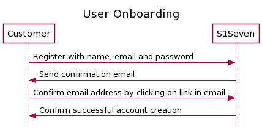
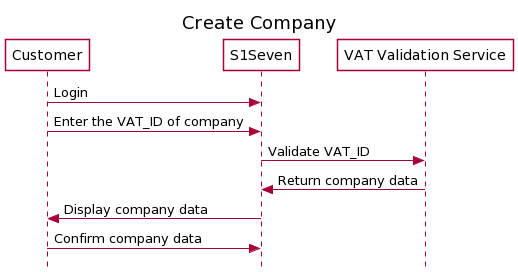
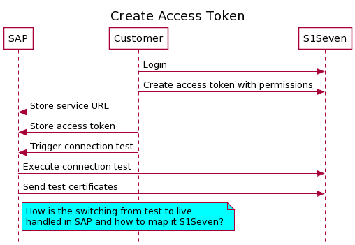
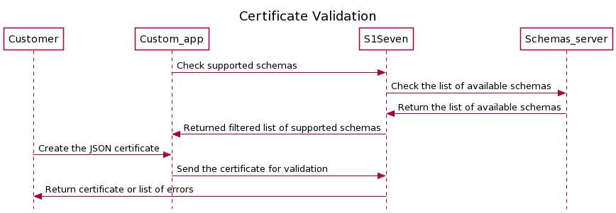
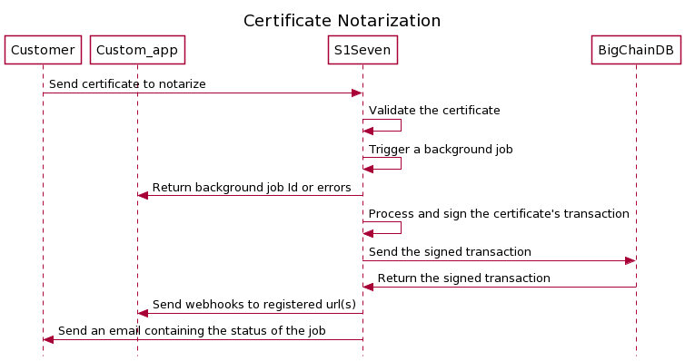

# API flows

[[toc]]

The following description details how S1Seven can notarize companies material certificates.
It assumes that no user and/or companies have been registered yet, so every prerequisite will be described in the following sections.

## Register user

<p align="left">
  
</p>

1. A new user can be registered using the [create user] endpoint.
2. If you need to resend the verification email, use [verify email] endpoint.
3. Once you confirmed the user creation, you can [login], if successful it will return an `accessToken` and `refreshToken` that can be used in `Authorization` and `Refresh` HTTP headers to authenticate the next calls to our services. Those values will also be set in cookies.
4. Retrieve user information with [me] endpoint
5. You can call the [refresh token] endpoint with the `Refresh` HTTP header value set to `refreshToken` returned above, to create a new `accessToken` once it has expired or call the [login] endpoint.

Note:
The `refreshToken` should be stored safely as it is available for 60 days.

## Register a company

<p align="left">
  
</p>

1. [login]
2. A new company can be registered using the [create company] endpoint.
3. Once created you can get the list of the user's companies with the [me] endpoint.

## Create an access token

<p align="left">
  
</p>

The best way to authenticate when using directly the API is with a long live access token.

1. To generate a long lived token, you can use the [create accesstoken] endpoint. You should also set the `company` HTTP header with the company's Id you previously created and set the scope (which action on which resource) that this token will grant access to.

- Example scopes

```json
{
  "auth": {
    "actions": ["read_one"]
  },
  "cointypes": {
    "actions": ["read_one", "read_many"]
  },
  "nodes": {
    "actions": ["read_one", "read_many"]
  },
  "wallet": {
    "actions": ["read_one"]
  },
  "identities": {
    "actions": ["read_one", "read_many"]
  },
  "transactions": {
    "actions": ["sign", "send", "read_one"]
  },
  "companies": {
    "actions": ["read_one", "update_one"]
  },
  "certificates": {
    "actions": ["read_one", "validate_one", "notarize_one"]
  },
  "hooks": {
    "actions": ["create_one", "read_one", "read_many"]
  },
  "events": {
    "actions": ["read_one", "read_many"]
  },
  "mailhooks": {
    "actions": ["create_one", "read_one", "read_many"]
  },
  "mails": {
    "actions": ["read_one", "read_many"]
  }
}
```

Note:

- The access token is restricted to a company resources and a mode.

- The access token (`jwt` property in the response) should be stored safely as it is available for 1 year.

## Create a wallet

A wallet allows a company to generate key pairs to sign document and transactions on the blockchain, it is composed by a mnemmonic phrase that is the root of all key pairs.

1. To create a new wallet you can call the [create wallet] endpoint. You should also set the `company` HTTP header with the company's Id you previously created.

The body content is optional.

Note:
The `mnemonic` that will be returned should be stored with extra care, as it will be displayed only once and it allows to recreate key pairs used to sign transactions directly on the blockhain.

## Create a first identity

The identities contains metadata that allows our service to create keypairs without exposing or storing their private parts. Each identity gives the path to one specific keypair that you will use in a later step to notarize certificates.

1. To create an identity, use the [create identity] endpoint.

You should set several parameters:

- the `company` HTTP header with the company's Id you previously created
- the `wallet` HTTP body property with the wallet's Id you previously created
- the `coinType` HTTP body property, should only be set to 822, it will scope and create keypairs working on BigChainDB.
- the `account` HTTP body property, constitute the first derivation level for the key pair creation, it can be mapped to a given department in a company for example.
- the `index` HTTP body property, constitute the second derivation level for the key pair creation, it allows to create key pairs for single usage and increase discretion of the transactions.

```json
{
  "coinType": 822,
  "account": 0,
  "index": 0,
  "wallet": "walletId"
}
```

## Register a HTTP webhook

1. To subscribe and react to events sent from our services, you can use [register hook] endpoint. You should also set the `company` HTTP header with the company's Id you previously created and set the scope (which action on which resource) that this hook will listen to.

## Handle webhooks

### Minimal webhook server

Create a file `webhook-server.js` with this content, it will start an HTTP server on port 9000.

```js
import { createHmac } from 'crypto';
import express from 'express';
import { fromPairs } from 'lodash';

function generateSignature(
  signature,
  body,
  API_SECRET
) {
  const { t, h } = fromPairs(signature.split(',').map((s) => s.split('=')));
  const tolerance = 5;
  const currentTimestamp = Math.floor(Date.now() / 1000);
  const expectedSignature = createHmac('sha256', API_SECRET)
    .update(body)
    .digest('hex');
  if (expectedSignature === h && currentTimestamp - Number(t) <= tolerance) {
    return expectedSignature;
  }
  return null;
}

function serializeBody(body) {
  function replacer(key, value) {
    if (value === null || value.constructor != Object) {
      return value;
    }
    return Object.keys(value)
      .sort()
      .reduce((s, k) => {
        s[k] = value[k];
        return s;
      }, {});
  }
  return JSON.stringify(body, replacer);
}

function startServer(API_SECRET) {
  const app = express();

  app.use(
    express.json({
      verify: (req, res, buffer) => {
        (req as any).rawBody = buffer;
      },
    })
  );

  app.post('/', (req, res) => {
    const body = serializeBody(req.body);
    const signature = generateSignature(
      req.headers['signature'],
      body,
      API_SECRET
    );
    if (!signature) {
      return res.sendStatus(401);
    }

    console.log('received webhook', req.body);
    return res.sendStatus(200);
  });

  app.listen(port, () => console.log('Webhook server started on port 9000.'));
}

(function (argv) {
  const secret = argv[2] || 'z6MkoQSb6frUdZw78QEGSKfaJ5d9Bd9WHyTqqVJtnXWMDbPP';
  const port = argv[3] || 8000;
  startServer(secret, port);
})(process.argv);
```

Start the server with :

```sh
node ./webhook-server.js <secret_returned_by_create_hook_endpoint>
```

Create a `local-tunnel.js` file, it will start a tunnel to redirect HTTP calls to `https://<my_subdomain>.loca.lt` (it should match the `connectionUrl` declared during hook registration) to your local webhook server. Alternatively you can also use `Ngrok`.

```js
import localtunnel from 'localtunnel';

(async (argv) => {
  const subdomain = argv[2] || 's1seven-pipe-service';
  const port = argv[3] || 8000;
  const tunnel = await localtunnel({ port, subdomain });
  console.log(`Tunnel available on ${tunnel.url}`);

  tunnel.on('close', () => {
    console.log(`Tunnel closed`);
  });
  process.on('beforeExit', () => {
    tunnel.close();
  });
})(process.argv);
```

Start the tunnel with your custom subdomain :

```sh
node ./local-tunnel.js <my_subdomain>
```

## Validate a certificate

<p align="left">
  
</p>

1. Create your own JSON certificate, you can check the supported schemas to be used in `RefSchemaUrl` by calling [supported schemas] endpoint.

2. Validate your certificate either by passing the json or the file (multipart/form-data) in the Http body with [validate json certificate] or [validate file certificate] endpoints.

## Render a certificate

1. You can render the certificate as HTML or PDF either by passing the json or the file (multipart/form-data) in the body with [render json certificate] or [render file certificate] endpoints.

You should set the `type` HTTP query with `html` or `pdf`

## Notarize a certificate

<p align="left">
  
</p>

1. You can notarize a certificate (the hash of serialized JSON) on BigChainDB by uploading a certificate to the [notarize file certificate] or the [notarize json certificate] endpoint.

You should set several parameters:

- the `company` HTTP header with the company's Id you previously created
- the `identity` HTTP query with an identity's Id you previously created
- the `mode` HTTP query, available values can be `test` and `live`
- the `content-type` HTTP header should be set to `multipart/form-data` or `application/json`

2. If the response is successful, a new background job will be triggered and you will receive an email confirmation containing the certificate once the job is done.

If you registered a hook with the `scopes` list containing

```json
{
  "resource": "certificates",
  "actions": ["notarize_one"]
}
```

you will also receive the payload on your registered HTTP endpoint (`connectionUrl`).

Note: We are currently studying another approach to get information about the background job status by polling a new dedicated endpoint.

## Verify a certificate

You can verify that a certificate has been notarized by uploading a file to the [verify certificate] endpoint. You must also provide the mode on which this certificate has been notarized by setting the HTTP query `mode=<expected_mode>`.

[create user]: https://app.s1seven.dev/users-service/api/#/users/UsersController_create
[verify email]: https://app.s1seven.dev/users-service/api/#/users/UsersController_sendConfirmationEmail
[login]: https://app.s1seven.dev/auth-service/api/#/auth/AuthController_login
[me]: https://app.s1seven.dev/users-service/api/#/users/UsersController_findMe
[refresh token]: https://app.s1seven.dev/auth-service/api/#/auth/AuthController_refresh
[create company]: https://app.s1seven.dev/users-service/api/#/companies/CompaniesController_create
[create accesstoken]: https://app.s1seven.dev/auth-service/api/#/accesstoken/AccessTokensController_create
[create wallet]: https://app.s1seven.dev/km-service/api/#/wallet/WalletsController_create
[create identity]: https://app.s1seven.dev/km-service/api/#/identities/IdentitiesController_create
[register hook]: https://app.s1seven.dev/pipe-service/api/#/hooks/HooksController_create
[supported schemas]: https://app.s1seven.dev/cert-service/api/#/certificates/CertificatesController_getSupportedSchemas
[validate json certificate]: https://app.s1seven.dev/cert-service/api/#/certificates/CertificatesController_validateCertificate
[validate file certificate]: https://app.s1seven.dev/cert-service/api/#/certificates/CertificatesController_validateCertificateFile
[render json certificate]: https://app.s1seven.dev/cert-service/api/#/certificates/CertificatesController_render
[render file certificate]: https://app.s1seven.dev/cert-service/api/#/certificates/CertificatesController_renderFile
[notarize json certificate]: https://app.s1seven.dev/cert-service/api/#/certificates/CertificatesController_notarize
[notarize file certificate]: https://app.s1seven.dev/cert-service/api/#/certificates/CertificatesController_notarizeFile
[verify certificate]: https://app.s1seven.dev/cert-service/api/#/certificates/CertificatesController_verify
