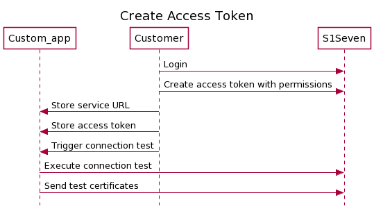
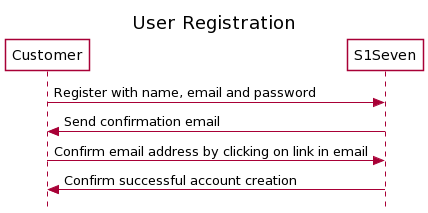
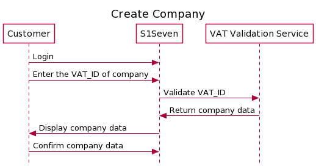

# General API information

Integrating S1Seven services within your server application, such as a SAP module, an automated delivery note service, or any other application managing quality certificates, is accomplished with the S1Seven REST API.

[[toc]]

## Swagger

All endpoints documented here will link to a Swagger UI hosted on our staging webservices allowing you to try the API with the closest conditions from production systems. For convenience, a Swagger UI aggregating all endpoints is available [here](../openapi).

1. On the top left, select the server address matching the address of the Swagger you are currently browsing.

2. On the top left, click `Authorize` button. Once logged in or if you use a long lived access token, fill the `bearer` field with your access token.

## Services

### Auth service

- Subdomain: `auth`

The auth service is responsible for all authentication operations such as login / logout, access token generation and sessions management.

Open the [Auth service] API.

### User service

- Subdomain: `user`

The user service is responsible for all CRUD operations related to user resources management.

Open the [User service] API.

### Key Management service

- Subdomain: `km`

The KM service allows to manage resources related to crypto operations such as wallets, identities, transactions.

This service is deployed on 2 addresses to distinguish two modes, `test` and `live`. The access to `live` requires a subscription and is only available in production enviroment, whereas the `test` mode allows to try our services without the risk of losing sensitive information.

TODO: describe relation with wallet service

Open the [KM service] API.

### Certificate service

- Subdomain: `certificate`

The Certificate service allows to manipulate quality certificates. The logical flow to use its API would be the following :

1. Validate the certificate being created on your application

2. Render the certificate as PDF or HTML once it is valid

3. Notarize the certificate on the blockchain once the product is ready to be delivered

4. Verify that a certificate received from a partner has been notarized

Open the [Certificate service] API.

### Pipe service

- Subdomain: `pipe`

The Pipe service allows to synchronize in realtime your application workflow with resources managed on S1Seven platform.

You can register webhooks or create email subscriptions to watch changes on selected resources and to be notified of these events.

Open the [Pipe service] API.

## REST API Requests

The API access pattern for all S1Seven REST endpoints is:

`https://<s1seven_service_subdomain>.<s1seven_domain>/<service_resources>`

or

`https://<s1seven_proxy>.<s1seven_domain>/api/<service_resources>`

or

`https://<s1seven_proxy_subdomain>.<s1seven_domain>/<s1seven_service>/<service_resources>`

The expected value for `<s1seven_service>` is the name of the service, such as auth-service, user-service, km-service, certificate-service, pipe-service.

::: details The list of valid resources and actions per service :

```json
  "auth-service" : {
    "auth": {
      "actions": ["read_one", "create_one", "sign_in", "sign_out", "revoke"]
    },
    "sessions": {
      "actions": ["read_one", "read_many", "delete_one", "delete_all"]
    },
    "accesstoken": {
      "actions": ["read_one", "read_many", "create_one", "update_one", "delete_one"]
    }
  },
  "user-service" : {
    "users": {
      "actions": ["read_one", "read_many", "create_one", "update_one", "delete_one", "confirm", "reset"]
    },
    "companies": {
      "actions": ["read_one", "read_many", "validate_one", "create_one", "update_one", "delete_one", "confirm"]
    }
  },
  "km-service" : {
    "cointypes": {
      "actions": ["read_one", "read_many", "create_one", "update_one", "delete_one"]
    },
    "nodes": {
      "actions": ["read_one", "read_many", "create_one", "update_one", "delete_one"]
    },
    "wallets": {
      "actions": ["read_one", "create_one", "update_one", "delete_one"]
    },
    "identities": {
      "actions": ["read_one", "read_many", "create_one"]
    },
    "transactions": {
      "actions": ["read_one", "read_many", "partial_sign", "sign", "send"]
    }
  },
  "certificate-service" : {
    "certificates": {
      "actions": ["read_one", "create_one", "validate_one", "render_one", "notarize_one"]
    }
  },
  "pipe-service" : {
    "hooks": {
      "actions": ["read_one", "read_many", "create_one", "update_one", "delete_one"]
    },
    "events": {
      "actions": ["read_one", "read_many", "update_one", "retry_one"]
    },
    "mailhooks": {
      "actions": ["read_one", "read_many", "create_one", "update_one", "delete_one"]
    },
    "mails": {
      "actions": ["read_one", "read_many", "update_one", "retry_one"]
    }
  },
```

:::

### Example

To show how to access resources, let's take the `sessions` resource from `auth-service` as an example, located under the development subdomain `s1seven.ovh` :

- https://auth.s1seven.ovh/sessions
- https://app.s1seven.ovh/api/sessions/
- https://app.s1seven.ovh/auth-service/sessions/

## Error Handling

Responses are formatted in the standard REST format, with a status field showing an error code and a message field with a text description of the error. The possible error codes are described with each API endpoint. The message can be a string, a string array or a JS object.

For example, here is the response for a failed login request:

`https://<s1seven-proxy>/api/auth/login`

```json
{
  "statusCode": 401,
  "path": "/auth/login",
  "timestamp": "2021-06-10T14:40:52.602Z",
  "message": "Wrong credentials provided"
}
```

## Authentication

Most endpoints require authentication to submit a request to the S1Seven servers. The API reference for each endpoint specifies the types of authentication needed to access the endpoint.

S1Seven uses username/password and access tokens to add a layer of security to the API requests from users.

### Username and Password

For short term access, such as for the web UI, the user can use a username (or email) and password to generate an access token and a refresh token by calling the [login] endpoint. The access token must be added to the authorization header (as a bearer token) to every REST call.

The following code samples show the types of authentication that can be used with this endpoint.

```sh
curl --request POST \
  --url https://<auth-service>/auth/login \
  --header 'content-type: application/json' \
  --data '{
    "username":"so",
    "password":"password"
  }'
```

::: tip
The access token is valid for 15 minutes and the refresh token is valid for 60 days.
:::

### Access Token Usage

Once you have an access token, you can call endpoints using it, such as:

```sh
curl --request GET \
--url http://<user-service>/companies/<company-id> \
--header 'authorization: Bearer <jwt>'
```

The header field has the format:

`--header 'authorization: Bearer <token>'`

### Refresh the token

Once you have a refresh token, you can use the [refresh token] endpoint to get a new access token.

This is an example of refreshing the token:

```sh
curl --request GET \
 --url https://<auth-service>/auth/refresh \
 --header 'content-type: application/json' \
 --header 'refresh: Bearer <jwt>'
```

### Long lived access token

#### Create

<p align="left">
  
</p>

::: tip
The access token is restricted to a company resources and a mode.
:::

For applications or scripts that require long term access, an access token key with a one-year time limit can be created by calling the [create accesstoken] operation and setting :

- the companyId in `company` header,
- the `mode` in the query,
- an optional `description`,
- an optional expiration timestamp in seconds, `expiresIn` default to one year.
- the scopes (which actions on which resource) that this token will grant access to.

The returned JWT must be added to the authorization header (as a bearer token) for every REST call. The Admin can generate several API keys for different app usages.

```sh
curl --request POST \
 --url https://<auth-service>/accesstoken?mode=test \
 --header 'content-type: application/json' \
 --header 'company: <company-id>' \
 --header 'authorization: Bearer <jwt>' \
 --data '{
   "description": "test token",
   "expiresIn": 1843565761,
   "scopes": {
      "auth": {
        "actions": ["read_one"]
      }
    }
  }'
```

::: details Example Scopes

```json
{
  "auth": {
    "actions": ["read_one"]
  },
  "cointypes": {
    "actions": ["read_one", "read_many"]
  },
  "nodes": {
    "actions": ["read_one", "read_many"]
  },
  "wallet": {
    "actions": ["read_one"]
  },
  "identities": {
    "actions": ["read_one", "read_many"]
  },
  "transactions": {
    "actions": ["sign", "send", "read_one"]
  },
  "companies": {
    "actions": ["read_one", "update_one", "validate_one"]
  },
  "certificates": {
    "actions": ["read_one", "validate_one", "notarize_one"]
  },
  "hooks": {
    "actions": ["create_one", "read_one", "read_many"]
  },
  "events": {
    "actions": ["read_one", "read_many"]
  },
  "mailhooks": {
    "actions": ["create_one", "read_one", "read_many"]
  },
  "mails": {
    "actions": ["read_one", "read_many"]
  }
}
```

:::

::: tip
For a complete list of available scopes, refer to `CompanyTokenScopesDto` in the OpenAPI documentation.
:::

::: warning
The access token (`jwt` property in the response) should be stored safely as it is available for 1 year.
:::

#### Revoke

TODO: revoke access token

## Common requests

### Register user

<p align="left">
  
</p>

1. A new user can be registered using the [create user] endpoint.
2. If you need to resend the verification email, use [verify email] endpoint.
3. Once you confirmed the user creation, you can [login], if successful it will return an `accessToken` and `refreshToken` that can be used in `Authorization` and `Refresh` HTTP headers to authenticate the next calls to our services. Those values will also be set in cookies.
4. Retrieve user information with [me] endpoint
5. You can call the [refresh token] endpoint with the `Refresh` HTTP header value set to `refreshToken` returned above, to create a new `accessToken` once it has expired or call the [login] endpoint.

::: warning
The `refreshToken` should be stored safely as it is available for 60 days.
:::

### Register a company

<p align="left">
  
</p>

1. [login]
2. A new company can be registered using the [create company] endpoint.
3. Once created you can get the list of the user's companies with the [me] endpoint.

### Find own user

To fetch information about the user and companies attached to that account, the [find user] endpoint can be used. The user id is deducted from the JWT token provided in the header.

```sh
curl --request GET \
  --url https://<user-service>/users/me \
  --header 'content-type: application/json' \
  --header 'authorization: Bearer <jwt>'

```

[auth service]: https://auth.s1seven.ovh/api
[user service]: https://user.s1seven.ovh/api
[km service]: https://km.s1seven.ovh/api
[certificate service]: https://certificate.s1seven.ovh/api
[pipe service]: https://pipe.s1seven.ovh/api
[create user]: https://app.s1seven.ovh/users-service/api/#/users/UsersController_create
[find user]: https://app.s1seven.ovh/users-service/api/#/users/UsersController_findMe
[verify email]: https://app.s1seven.ovh/users-service/api/#/users/UsersController_sendConfirmationEmail
[login]: https://app.s1seven.ovh/auth-service/api/#/auth/AuthController_login
[me]: https://app.s1seven.ovh/users-service/api/#/users/UsersController_findMe
[refresh token]: https://app.s1seven.ovh/auth-service/api/#/auth/AuthController_refresh
[create company]: https://app.s1seven.ovh/users-service/api/#/companies/CompaniesController_create
[create accesstoken]: https://app.s1seven.ovh/auth-service/api/#/accesstoken/AccessTokensController_create
